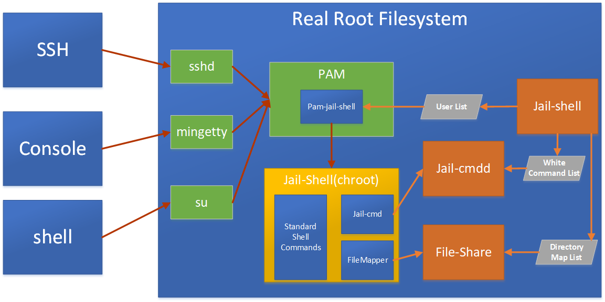

jail-shell安全受限shell
==============
jail-shell安全受限shell是一个Linux环境下的安全工具，主要使用chroot, namespace技术，限制用户执行特定的命令，和访问特定的目录。 

可将用户通过ssh, scp, sftp，telnet, 终端等方式登录限制到安全的运行环境中。 

可用于webhost的ssh受限访问；企业管理员的权限分级管理；一体化产品的权限控制。 

功能列表
==============
- **易于使用**

   通过配置文件，自动生成chroot运行环境，提供jail-shell管理命令方便添加、查看、删除受限用户，以及安装、删除chroot运行环境。

- **chroot技术限制用户访问范围**

   采用Linux chroot技术，限制用户的目录访问范围，避免用户访问受限信息，防止用户对系统做破坏。

- **目录只读保护**

   对chroot运行环境进行只读保护，避免需要保护的目录被修改、文件被破坏；避免用户创建设备文件，访问系统受限文件，并避免执行外部可执行文件。

- **namespace限制用户可见范围**

   采用Linux namespace技术，限制用户pid，mount目录的可见范围，避免信息泄漏。

- **系统命令通道**

   提供系统命令代理通道，允许用户在chroot环境中执行真实系统的受限命令，在提供必要功能的情况下，保护系统。

- **自动处理chroot环境命令依赖**

   只需要提供命令列表，即可自动将命令依赖的动态库复制到chroot环境，避免手工复制动态库的繁杂工作。

- **capabilities限制**

   丢弃关键的capabilities权限，避免系统，chroot运行环境被rootkit破解。

- **多Linux操作系统支持**

   支持redhat, sles, debian及其衍生的操作系统。

架构说明
==============

安全受限shell包含3部分，pam插件，jail-cmd命令代理，jail-shell命令工具。

- **pam_jail_shell插件**：

    主要控制登录的用户，根据配置列表，将登录的用户采用chroot, namespace技术，限制在特定的受限目录中。

- **jail-cmd命令代理**：

    主要将命令转发到真实的系统中，如用户密码修改，或其他用户相关的业务命令的执行，并对命令做注入检测，防止注入。

- **jail-shell工具**：

    主要提供管理安全受限shell的功能，让用户更加易于使用，包括用户的添加、删除，shell的配置，安装，删除。

**说明**
1. 用户通过ssh, 终端，telnet等shell管理工具登录到系统后，pam_jail_shell插件根据配置列表，将登录用户的访问范围限制在指定的chroot环境中。
2. 管理员通过jail-shell命令，管理受限用户名单列表，以及管理chroot环境的命令列表，并配置目录的访问范围。
3. jail-cmd代理用户执行的系统命令，辅助实现必要的业务功能。


编译安装
==============
**编译**
```
git clone https://github.com/pymumu/jail-shell.git
cd jail-shell
make 
```

**安装**
```
sudo make install
```

**卸载**
```
sudo /usr/local/jail-shell/install -u
```

使用
==============
安装完成后，可使用jail-shell命令管理安全受限shell，通过`jail-shell -h`查看命令帮助  
在使用上，步骤如下：  
1. 使用`useradd username`命令添加用户到系统中。
2. 使用`jail-shell jail`创建安全受限shell配置，并创建受限运行环境。
3. 使用`jail-shell user`将用户添加到受限系统中。

使用举例
-------------
如下以将test用户，添加到安全受限shell为例。  
1. 添加test用户，并设置密码
```shell
sudo useradd test
sudo passwd test
```

2.创建安全受限shell运行环境
```shell
sudo jail-shell jail -e test-jail
```
执行上述命令后，将使用模板创建新的安全shell配置，并使用vi打开编译，可使用`vi`命令`:w!`保存后退出。
使用命令`jail-shell jail -l`可以查看已经配置的安全受限shell列表。

3.安装安全受限shell运行环境
```shell
sudo jail-shell jail -i test-jail
```

4.将test用户加入到安全受限shell中。
```shell
sudo jail-shell user -a test -j test-jail
```

5.使用ssh连接到安全受限shell中进行测试验证
```shell
ssh test@127.0.0.1
```

配置文件格式说明
-------------
此配置文件用于生成制定的jail，将需要的文件，命令复制到jail中。  
配置支持如下命令：
- **dir: 创建目录**  
  * 参数：  
`dir PATH MODE OWNER`  
  * 例子：  
`dir /bin/ 0755 root:root`  

- **file: 复制文件**  
  * 参数：  
`file SRC DEST MODE OWNER`  
  * 例子：  
`file /etc/nsswitch.conf /etc/nsswitch.conf 0644 root:root`

- **hlink: 创建硬链接文件**  
  * 参数：  
`hlink SRC DEST `  
  * 例子：  
`hlink /etc/localtime /etc/localtime`  

- **slink: 创建符号连接**  
  * 参数：  
`slink TARGET LINKNAME`  
  * 例子：  
`slink /bin/bash /bin/sh`

- **clink: 先硬连接创建文件，若失败则复制文件**  
  * 参数：  
`clink SRC DEST `  
  * 例子：  
`clink /etc/localtime /etc/localtime`  

- **node: 创建设备文件**  
  * 参数：  
`node PATH TYPE MAJON MINOR MODE OWNER`  
  * 例子：  
`node /dev/null c 1 3 666 root:root`  
  * 安全说明：  
应该避免添加块设备文件。

- **bind: 绑定映射目录**  
  * 参数：  
`bind [SRC] DEST OPTION`  
OPTION: rw,ro,dev,nodev,exec,noexec  
查阅`man mount`获取参数说明   
  * 例子：  
`bind / ro,nodev,nosuid`  
`bind /opt/ /opt/ ro,nodev,noexec`  

- **cmd: 执行系统内命令**  
  * 参数：  
`cmd SRC DEST RUN_AS_USER`  
RUN_AS_USER: 指定执行命令的用户，-:-表示chroot环境中的用户。  
  * 例子：  
`cmd /usr/bin/passwd /usr/bin/passwd -:- `  
`cmd /some/root/command /some/root/command root:root`  
`cmd /some/user/command /some/user/command user:user `  
  * 安全说明：  
此通道可能导致用户从chroot环境中逃狱，所以，添加的命令必须避免被注入。  

安全注意事项
-------------
使用安全受限shell时，应采取最小安全授权原则。在保证使用功能的前提下，减少用户权限。
1. bind安全注意事项
  * 对于除/dev目录外，建议增加`nodev`参数，/dev目录设置`ro,noexec`(只读，禁止可执行文件)权限
  * 对于chroot运行环境目录，建议设置`ro,nodev,nosuid`(只读，禁止设备文件，禁止suid文件)权限。
  * 对于可写目录，建议设置`nodev,noexec,nosuid`(禁止设备文件，禁止可执行文件，禁止suid文件）权限。

2. 避免的命令
  * 应该避免：`gdb, mount, strace`等调试命令。


文件目录说明：
==============
|目录                              |说明                                                             |
|-------------------------------   |-----------------------------------------------------------------|
|`/etc/jail-shell/`                |配置文件目录                                                     |
|`/etc/jail-shell/jail-shell.conf` |受限用户配置列表文件                                             |
|`/etc/jail-shell/jail-config/`    |安全受限shell配置文件所在目录，后缀为.cfg文件即被识别为配置文件。|
|`/var/local/jail-shell/`          |受限安全shell数据目录                                            |
|`/var/local/jail-shell/jails`     |受限安全shell chroot运行环境目录                                 |
|`/usr/local/jail-shell`           |jail-shell程序目录                                               |

调试chroot环境
==============
当向chroot环境中复制命令后，复制后的命令如果执行失败，则需要调试，找出缺少的文件，并添加到chroot环境中。

调试需要的工具：`strace`， 调试方法如下  
将strace命令复制到chroot环境中，然后使用strace执行需要调试的命令，找出执行命令缺少的文件。对应的调试命令如下  
```shell
strace -F -eopen command
```
-eopen表示跟踪进程打开的文件列表， 必要时，可以不使用此参数。

执行上述命令后，排查打开失败的文件列表是否在chroot环境中。
```shell
open("/etc/ld.so.preload", O_RDONLY)    = -1 ENOENT (No such file or directory)
```
如上表示：/etc/ld-so.preload文件读取时不存在，可能需要将上述文件添加到chroot环境中。这时可使用`clink`，`file`命令将缺失文件添加到chroot环境中。

License
==============
jail-shell安全受限shell采用GPL-V2 License。

类似工具
==============
[jailkit https://olivier.sessink.nl/jailkit/](https://olivier.sessink.nl/jailkit/)  
[rshell https://en.wikipedia.org/wiki/Restricted_shell](https://en.wikipedia.org/wiki/Restricted_shell)  
[firejail https://github.com/netblue30/firejail](https://github.com/netblue30/firejail)  

